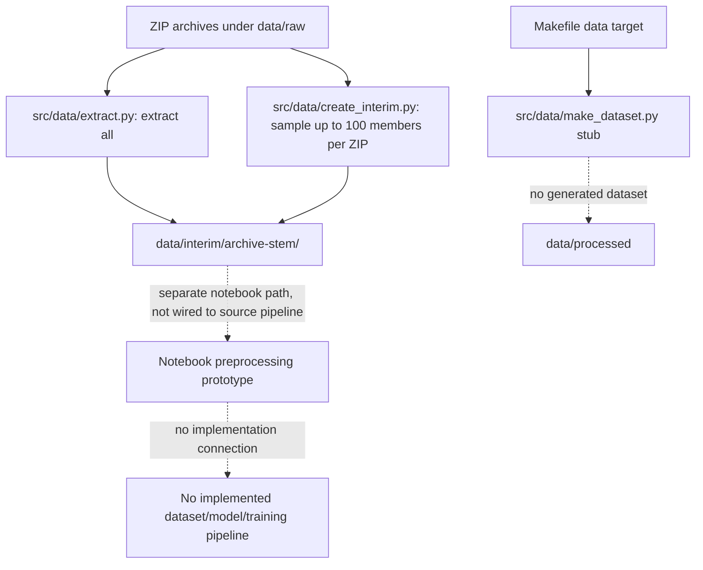

# Project Architecture

## Project overview

The repository is a Cookiecutter Data Science scaffold with TB chest-X-ray exploration and preprocessing work in notebooks. Its stated/implicit objective is binary classification of chest X-rays (the preprocessing notebook uses `normal` and `TB` folders), but the repository does not currently implement a complete classifier or training application.

**Status:** The documented pipeline below distinguishes implemented source behavior from notebook experiments. No model architecture or executable training/evaluation pipeline was found.

## Repository structure

```text
.
├── data/                     # Data directories; raw contents intentionally not inspected
│   ├── raw/
│   ├── interim/
│   └── processed/
├── docs/                     # Sphinx scaffold
├── models/                   # Intended model artifacts; no training implementation found
├── notebooks/
│   ├── 01_data_exploration.ipynb
│   ├── 02_data_preprocessing.ipynb
│   └── 03_data_annotation.ipynb
├── reports/figures/
├── src/
│   ├── data/
│   │   ├── create_interim.py
│   │   ├── extract.py
│   │   └── make_dataset.py
│   ├── features/build_features.py
│   ├── models/
│   │   ├── predict_model.py
│   │   └── train_model.py
│   └── visualization/visualize.py
├── Makefile
├── requirements.txt
├── setup.py
└── test_environment.py
```

The source modules `features/build_features.py`, `models/train_model.py`, `models/predict_model.py`, and `visualization/visualize.py` are empty. `src/data/make_dataset.py` is a command skeleton and does not produce output data.

## Data pipeline

Two independent archive utilities are present:

- `src/data/extract.py` finds `*.zip` directly in `data/raw/` and extracts each archive into `data/interim/<archive-stem>/` using `ZipFile.extractall`.
- `src/data/create_interim.py` selects up to 100 non-directory archive entries per ZIP and copies them to `data/interim/<archive-stem>/`, preserving archive-relative names. Selection uses Python's global `random` state and has no configured seed. It samples archive members, not specifically image files.

Neither utility labels data, creates a split, or creates `data/processed`. The Makefile's `data` target instead runs `src/data/make_dataset.py data/raw data/processed`; that script only logs a message and performs no transformation.



The notebook refers to a nested `data/interim/.../partitioned_dataset` layout containing `normal` and `TB` folders. That layout is an example/hard-coded notebook path, not a contract enforced by the source scripts.

## Preprocessing

`notebooks/02_data_preprocessing.ipynb` contains exploratory code for grayscale chest X-rays:

1. Read with OpenCV in grayscale and inspect shape, pixel range, and type.
2. Check for unreadable images, small dimensions, and very dark images. The notebook uses differing thresholds: validation flags under 100 pixels, while `is_valid_image` accepts dimensions as small as 50 pixels and rejects mean intensity below 5.
3. Crop a fixed central region: 10% off top/bottom and 15% off left/right.
4. Resize to 224×224 while preserving aspect ratio through padding.
5. Apply a 3×3 median blur, then CLAHE with `clipLimit=2.0` and `tileGridSize=(8, 8)`.
6. Convert to float32 and divide by 255; standardize with hard-coded `train_mean=0.61313236` and `train_std=0.25896055`.

The notebook also shows alternative denoising/contrast/resizing experiments. Its `preprocess_xray` function returns `None` for an invalid image. No source-code caller uses this function. The normalization values are embedded in the notebook; how they were derived for a final training split is not established. A statistics helper is present but only scans up to a sample limit and is notebook code, not part of the source pipeline.

## Dataset / DataLoader

**Implemented:** None. No dataset class, framework DataLoader, batch construction, label encoding, augmentation pipeline, or train/validation/test split was found.

**Notebook behavior:** The preprocessing notebook accesses files directly from class-named folders, but does not define a reusable dataset abstraction or training batches.

## Model architecture

**Unknown / not implemented.** `src/models/train_model.py` and `src/models/predict_model.py` are empty. No layers, pretrained backbone, input contract, loss, optimizer, or serialized weights are defined in the inspected source. The repository therefore has no actual model architecture to document.

## Training pipeline

**Not implemented.** There is no training loop, CLI, checkpointing, optimizer/scheduler setup, or command to start training. The only Makefile data command runs the no-op dataset script. There is no `make train` target.

## Validation and evaluation

There is no model-validation or test-evaluation implementation, no metric calculation, and no evaluation split. The preprocessing notebook's `validate_dataset` function performs basic image-quality checks only; it is not model validation and is not connected to training.

## Configuration

No project-specific model/training configuration file was found. The Makefile defines generic variables such as `PROJECT_NAME`, `PYTHON_INTERPRETER`, and optional S3 bucket/profile settings. The preprocessing notebook hard-codes a data path, target size, and normalization constants. Dataset locations and those preprocessing values are not centrally configured.

## Dependencies

`requirements.txt` contains:

- `-e .` (editable local package)
- `click`
- `Sphinx`
- `coverage`
- `awscli`
- `flake8`
- `python-dotenv>=0.5.1`

The preprocessing notebook imports NumPy, Matplotlib, Pillow, and OpenCV (`cv2`), but these are not listed in `requirements.txt`. No deep-learning framework is declared. The actual runtime requirements for running the notebooks are therefore not captured by the project dependency file.

`setup.py` uses `find_packages()` and generic package metadata. `test_environment.py` checks only that Python's major version is 3; it does not test project dependencies, GPU availability, or data/model functionality.

## Execution flow

Available source commands:

- `python src/data/extract.py` — extract all ZIP archives from `data/raw/` into `data/interim/`.
- `python src/data/create_interim.py` — create random samples in `data/interim/`.
- `make data` — install prerequisites through the Makefile target chain, then invoke `src/data/make_dataset.py`; currently this only logs and does not make a dataset.
- `make requirements` — run the Python-major-version check and install `requirements.txt`.
- `make lint` — run flake8 on `src`.

Notebook execution is manual. No end-to-end command runs extraction, preprocessing, model training, evaluation, or inference.

## Hardware and runtime

The environment check expects Python 3, but no exact Python version is pinned. The repository does not specify CPU/GPU requirements, CUDA/cuDNN versions, memory needs, or a deep-learning runtime. Hardware compatibility and training runtime are **unknown** because no model/training code exists.

## Known issues / TODOs

- Implement a real dataset-building step; the existing Makefile data target currently reaches a stub.
- Define and enforce a canonical dataset layout, labels, and image formats.
- Add deterministic, documented data splitting and prevent related/patient images from crossing splits where identifiers allow.
- Move selected preprocessing into reusable source code and ensure inference uses the same transformations as training.
- Reconcile image-validity thresholds and determine normalization statistics from the intended training data only.
- Implement a Dataset/DataLoader, model, training entry point, checkpoint handling, prediction path, and evaluation metrics.
- Add required notebook and deep-learning dependencies with supported versions.
- Document configuration, installation, and actual execution commands.
- `notebooks/01_data_exploration.ipynb` and `notebooks/03_data_annotation.ipynb` could not be parsed by the repository reader during inspection; their contents are **unverified**.
- Archive extraction behavior and archive safety have not been validated against the dataset. Do not infer that the source archives or resulting files are complete or correctly labeled from the scripts alone.
